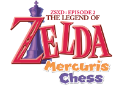

# Zelda XD2: Mercuris Chess

**Zelda XD2: Mercuris Chess** the sequel of the first *XD* parodic game, and was also released on April 1st, in 2017 this time. As a direct sequel, the overworld is expanded, the story is extended and the funny tone is kept, if not bettered!

- **Release Date:** April 1st, 2017
- **Players:** 1
- **Length:** 7-12 hours
- **License:** Copyrighted assets + CC BY-SA 4.0 assets. See `license.txt` for more information.
- **Languages:** French

## History

The game was made in 10 weeks (!), beginning with an a discussion about how people always mispronounce *Mercuris' Chest* (note the T at the end), our next game. Diarandor suggested that a game could be named *Mercuris Chess* to make fun of the title, and the same day it was decided that it would be the next big april’s fools joke.

The team workded really hard, and you can feel the improvements from the previous games. The game has 2 dungeons, and lots of side-quests and secrets everywhere, and also feature funny silly PNJs around the overworld. Be sure to speak to every one to not miss a joke!

## Synopsis

You do not need to have played the first XD game to enjoy Mercuris Chess. However, to appreciate the game’s introduction, you need to know that, in the first episode, Link locked Zelda up in his cave after a drinking night.

The story takes place some months after that terrible night. While Link was trying to make up for his fault, a very rich character named M. Grump took over the kingdom and bought everything.
